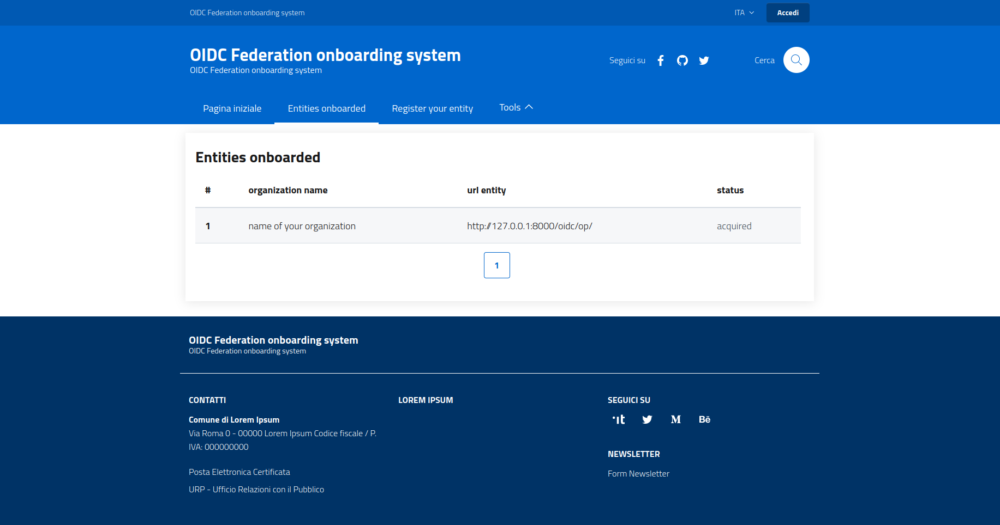
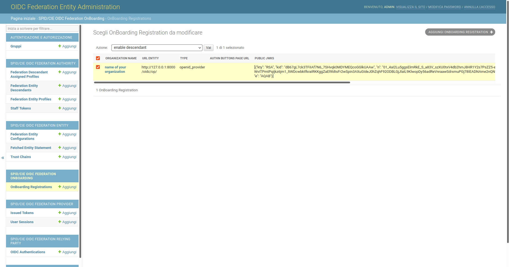

# OIDC Federation 1.0 onboarding service DEMO

> ⚠️ This application is only intended for demostration purpose and not for production use.

## General OnBoarding registration flow

The actions to accredit an entity within the demo federation are described below.

### Entity Registration

1. the legal representative of an entity/org accesses via SPID or CIE
   - __demo__ web resource `/onboarding/landing/`
   - __warning__ this onboarding demo comes with an unprotected registration page.
   The SPID and CIE authentication won't be involved in this demo.

2. becomes recognizable as an org affiliate and is given privileges to operate on
behalf of that org for the registration of an entity, if not already present within the federation.

To accredit a new entity, click to `Register your entity`

3. The user accesses the submission form of a federation entity, fill in the following REQUIRED fields:
    1. Organization Name (String)
    2. unique identifier of the entity (url) of the instance in production/stage (URL)
        1. validators:
            - download of the Entity Configuration, a self-signed statement
            - JWS signature validation
            - structure analysis of the JSON (json-schema)
            - presence and validation of the claim  __authority_hints__ that MUST matches to the onboarding system entity (trust anchor)
    3. TODO: IPA code or VAT number, that determines whether the participant is public or private (String)
        1. validators:
            - TODO: fetch and verify the IPA code from the national registry of public services
    4. public jwks (List[JSON])
        1. validators:
            - check if the jwks is public and not private (for sake!)
            - check of the presence of kid claim
            - check that the certificate is not expired
            - check that the kid is unique and of the lenght of a minimum JWK thumbprint length
    5. TODO: at least one administrative email contact (String)
        1. validators:
            - Email Field
    6. URL where the RP page shows the SPID and CIE authentication button
        1. validators:
            - Null, just for demo purpose
    7. TODO: SPID/CIE authentication request trigger url at the onboarding system testing OP
        1. validators:
            - Null, just for demo purpose

After successful submission it is redirected to the list of registered entities

### Entity OnBoarding

- all the required information are moved (copied) from the OnBoarding registration 
- from the admin panel a staff user can enable it as a FederationDescendant
- trust marks is automatically generated for the available profile, public or private
- the onboarding staff in any time can add more profiles and trust marks  through the FederationDescendant back office panel
- an entity configuration with trust marks and metadata policy applied, signed by the Trust Anchor of the onboarding system, is automatically created and published to its __Resolve Entity Statement__ endpoint.
- TODO: an email is sent to the user to inform on the succesfull state of the onboarding and the final entity configuration

### Enable entity as descendat

To enable the onboarded entity, go to admin panel:

- Click OnBoarding Registrations
- Select the entity you want to enable 
- Select action "enable descendant"
- submit

### next steps ( See the example in the documentation [CREATE_A_FEDERATION.md](../CREATE_A_FEDERATION.md) )

- assign profile to descendant
- configure a federation entity configuration

TODO:
### SPID/CIE QaD tests

Once the submission passes the initial checks the request is saved and a batch will start the
Automatic checks on the latter new registered entity. These check covers

- entity configuration:
    - reachability
    - signature validation
    - best practices checks following AgID and IPZS OIDC Fed guidelines.

- RP authz check following AgID and IPZS OIDC Fed guidelines.
- trust marks forgery (if present for recurrent sample checks)

The tests produces a json report.
this report would be also available in HTML format.

### Considerations

1. it would be necessary to "regulate" how the entities must expose a trigger url of the authn request.
This would allow us to batch automate testing and obtain asynchronous reports and request states.
Automatically a warning email would be sent to users.

2. It would be useful to standardize a "quota" to avoid that "the usual primers"
can make too many stupid requests all at once, that is, max N batch testing can be performed per day for a single applicant.
